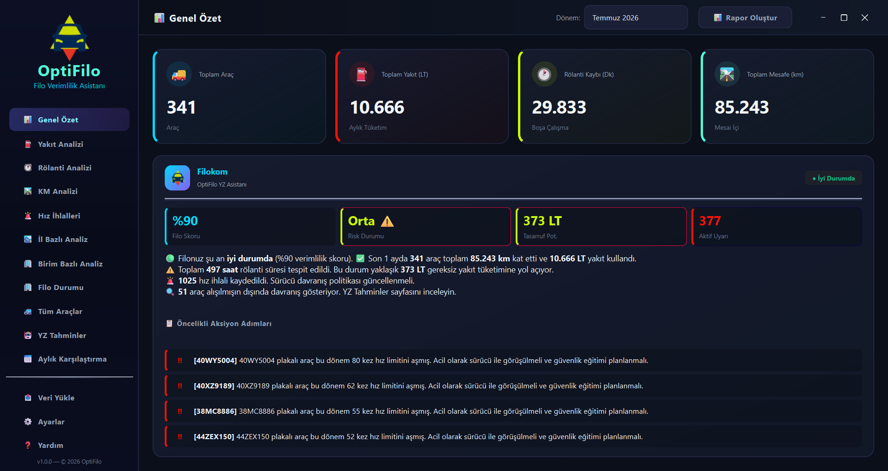

  

  # OptiFilo — Filo Verimlilik & Telematik Analiz Asistanı
  
  **Büyük filo operasyonlarında yakıt tüketimini optimize eden, rölanti kayıplarını tespit eden ve yapay zekâ ile karar destek sunan masaüstü analiz platformu.**

  

    
    
    
    
    
    
  

  [Genel Bakış](#-genel-bakış) •
  [Temel Özellikler](#-temel-özellikler) •
  [Ekran Görüntüleri](#-ekran-görüntüleri) •
  [Teknoloji Mimarisi](#-teknoloji-mimarisi) •
  [Gizlilik & Güvenlik](#-veri-güvenliği-ve-offline-first) •
  [İletişim](#-iletişim--demo-talebi)

---

> [!NOTE]
> **Telif Hakkı & Gizlilik Bildirimi**: Bu depo, **OptiFilo** masaüstü uygulamasının mimarisini, yeteneklerini ve arayüzünü tanıtmak amacıyla hazırlanmış **kapalı kaynaklı (closed-source)** bir ürün vitrinidir. Kaynak kodları kamuya açık paylaşılmamaktadır.

---

## 🚀 Genel Bakış

**OptiFilo**, yüzlerce veya binlerce araçtan oluşan kurumsal filoların telematik (araç takip) verilerini işleyen gelişmiş bir masaüstü analitik yazılımıdır. 

Geleneksel araç takip sistemleri devasa Excel tabloları üretirken, OptiFilo bu ham veriyi işleyerek:
- **Gizli maliyet kaçaklarını** (gereksiz rölanti, rota dışı mesai kullanımı, aşırı hız) açığa çıkarır,
- **Makine Öğrenmesi (Isolation Forest & K-Means)** ile anomali gösteren şüpheli araçları işaretler,
- Tek tıkla yönetim kurullarına sunulabilecek düzeyde **grafikli C-Level PDF ve Excel raporları** üretir.

---

## 📸 Ekran Görüntüsü

  <h3>📊 Yönetici Kontrol Paneli (Executive Dashboard)</h3>
  
  
<i>Filo genel durumu, anlık KPI sayaçları ve YZ destekli durum değerlendirmesi.</i>

   

---

## 🌟 Temel Özellikler

### 1. Akıllı Telematik Veri İçe Aktarımı & Normalizasyon
- Farklı araç takip sağlayıcılarından (Arvento, Filokom vb.) gelen ham Excel dosyalarını akıllı kolon eşleştirme (fuzzy matching) algoritmasıyla otomatik tanır.
- Bozuk, eksik veya hatalı biçimlendirilmiş verileri otomatik normalize eder.

### 2. Yapay Zekâ Destekli Anomali & Tahminleme Motoru
- **Anomali Tespiti (Isolation Forest):** Benzer km ve görev tipindeki araçlar arasında olağandışı yakıt ve rölanti tüketen filoları istatistiki olarak belirler.
- **Filo Segmentasyonu (K-Means):** Araçları kullanım yoğunluğuna ve aşınma riskine göre kümelere ayırır.
- **Gelecek Dönem Projeksiyonu:** Geçmiş verileri analiz ederek sonraki ay için olası yakıt ve yıpranma maliyetini tahmin eder.

### 3. Çok Boyutlu Kıyaslama & Segmentasyon
- **İl ve Bölge Bazlı:** Şehirler arası sürüş profili ve operasyonel verimlilik kıyaslaması.
- **Departman / Birim Bazlı:** Şirket içi birimlerin araç kullanım disiplini skorlaması.
- **Dönemsel Trend:** Bir önceki aya göre tüketim artış ve azalış oranları.

### 4. Tek Tıkla Kurumsal Raporlama
- **Grafikli C-Level PDF Raporu:** Yönetim kurullarına doğrudan sunulabilecek A4 formatında, renk kodlu ve grafikli raporlar.
- **Renklendirilmiş Excel Dökümü:** Koşullu biçimlendirme ve özet tablolar içeren hazır Excel tabloları.

---

## 🛠 Teknoloji Mimarisi

| Katman | Teknoloji / Kütüphane | Kullanım Amacı |
| :--- | :--- | :--- |
| **Arayüz (GUI)** | `PySide6 (Qt 6)` | Modern, yüksek DPI uyumlu, koyu/açık tema destekli masaüstü arayüzü |
| **Veri İşleme** | `Pandas`, `NumPy` | Yüksek hacimli telematik zaman serilerinin matrisel analizi |
| **Yapay Zekâ** | `Scikit-Learn`, `Joblib` | Isolation Forest (anomali) ve regresyon tahmin modelleri |
| **Görselleştirme**| `Matplotlib`, `Seaborn` | Dinamik analitik grafikler ve istatistiksel dağılımlar |
| **Raporlama** | `ReportLab`, `OpenPyXL` | Vektörel PDF üretimi ve gelişmiş Excel biçimlendirmesi |
| **Depolama** | `SQLite 3` | Tamamen yerel, hızlı ve ilişkisel veri saklama katmanı |
| **Dağıtım** | `PyInstaller` | Bağımsız, kurulum gerektirmeyen tekil Windows `.exe` çıktısı |

---

## 🔒 Veri Güvenliği ve Offline-First Yaklaşım

- **%100 Yerel Çalışma (On-Premise / Air-Gapped):** OptiFilo hiçbir veriyi harici bir bulut sunucusuna göndermez.
- **KVKK / GDPR Uyumlu:** Filo lokasyonları, sürüş saatleri ve kurumsal veriler yalnızca kullanıcının yerel bilgisayarındaki şifrelenebilir yerel veritabanında saklanır.
- **İnternet Bağımsız:** Makine öğrenmesi modelleri yerel olarak çalıştırılır; internet bağlantısı gerektirmez.

---

## 📄 Lisans & Telif Hakkı

© 2026 **YF CODE**. Tüm Hakları Saklıdır (All Rights Reserved).

Bu yazılımın tasarımı, analiz algoritmaları ve tüm fikri mülkiyet hakları saklıdır. Yazılı izin olmaksızın kaynak kodları, görseller veya türev çalışmalar kopyalanamaz, dağıtılamaz veya ticari amaçla kullanılamaz.

---

## 📬 İletişim & Demo Talebi

Yazılım hakkında detaylı bilgi almak, canlı demo talep etmek veya kurumunuza özel entegrasyon çözümleri için iletişime geçebilirsiniz:

- **Geliştirici / Şirket:** YF CODE
- **E-Posta:** `yfcodetr@gmail.com`
- **LinkedIn:** `https://www.linkedin.com/in/m-yusuf-uzun`
- **Web:** `https://yfcode.dev`
